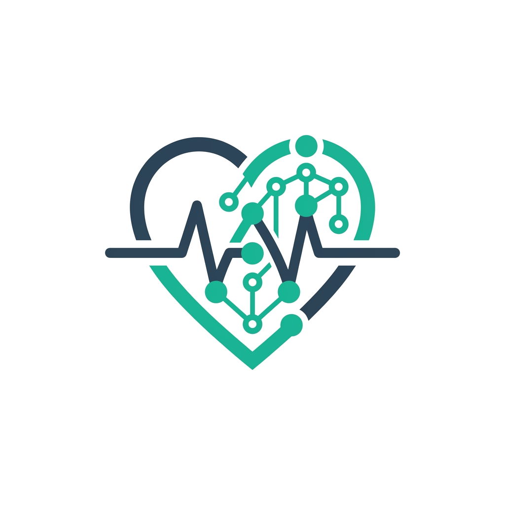
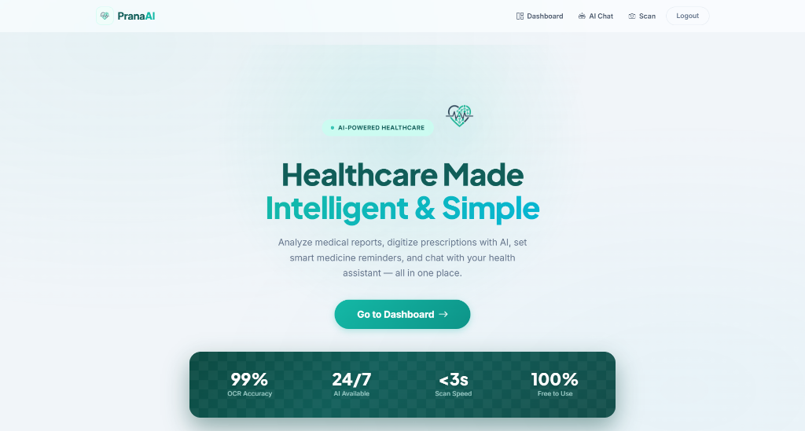
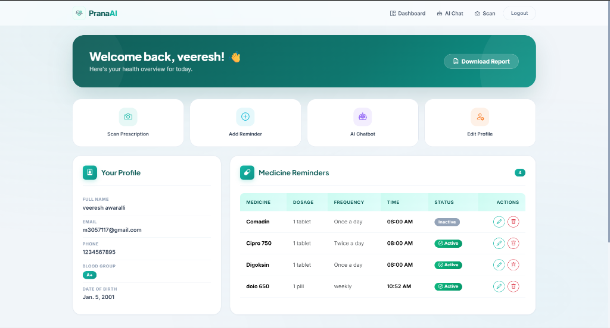
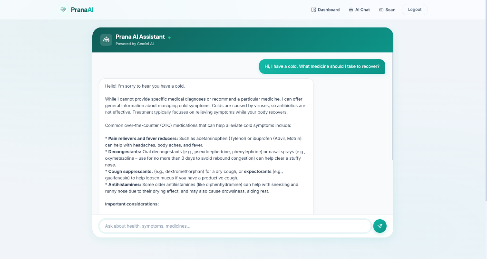
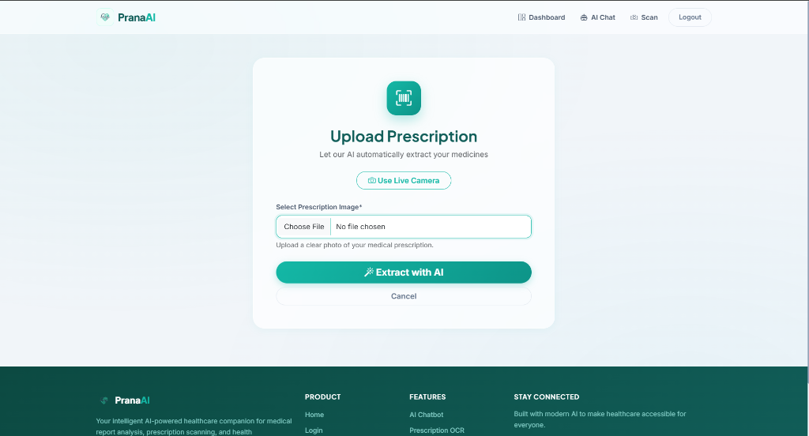
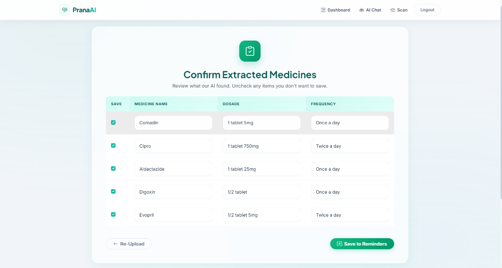

# Prana AI - Health in your hands

<p align="center">
  
</p>

**Prana AI** is an intelligent, beautifully designed healthcare companion web application. Built with a premium "glassmorphism" aesthetic and powered by modern AI, it empowers users to digitize their medical records, extract insights from handwritten prescriptions, and converse with a smart health assistant.

<p align="center">
  
</p>

---

## 🌟 Key Features

### 🎨 Premium User Interface
- **Glassmorphism Design:** Frosted glass cards, fluid gradients, and refined typography (Plus Jakarta Sans).
- **Responsive Dashboard:** A comprehensive, color-coded dashboard summarizing your health profile and reminders.
<br>
<p align="center">
  
</p>
<br>
- **Micro-Interactions:** Smooth `fadeInUp` animations, interactive hover states, and dynamic status indicators.

### 🤖 AI-Powered Chatbot
- **Gemini AI Integration:** Consult our smart health assistant for queries regarding symptoms, general well-being, and medical advice.
- **Modern Chat Interface:** Modeled after premium messaging apps with dynamic typing indicators and clickable suggestion pills.
<br>
<p align="center">
  
</p>
<br>

### 📸 Prescription Scanner (OCR)
- **Live Camera & Upload:** Seamlessly digitize handwritten prescriptions by taking a live photo or uploading a document.
- **Smart Data Extraction:** Automatically reads and extracts medicine names, dosages, and schedules.
<br>
<p align="center">
  
  
</p>
<br>

### 💊 Medication Reminders
- **Smart Tracking:** Keep track of all your active medications.
- **Full CRUD Support:** Easily add, edit, and safely delete your medication reminders.

### 📄 Intelligent Health Reports (PDF)
- **Premium PDF Generation:** Download beautifully formatted PDF reports summarizing your patient profile and active medications.
- **Custom Branding:** Features transparent alternating row colors, premium typography, and an ultra-subtle, non-intrusive watermark of the Prana AI logo.

---

---

## 🌍 Our Mission

Healthcare should be accessible, intelligent, and effortless. Prana AI was built with a core vision: to bridge the gap between complex medical data and patient understanding. We believe that by providing you with the right tools, you can take control of your health journey with confidence.

### Why Choose Prana AI?

- **Privacy First:** Your health data is your own. We prioritize secure, localized handling of your medical records.
- **Accessible AI:** Complex medical jargon is simplified instantly by our fine-tuned health assistant, making healthcare universally understandable.
- **Beautifully Simple:** Managing your health shouldn't feel like a chore. Our soothing, premium interface is designed to reduce anxiety and create a calming user experience.

---

## 🚀 Experience the Future of Healthcare

Prana AI is more than just an app; it's your personal health advocate available 24/7. From digitizing your latest doctor's visit to ensuring you never miss a dose of medication, we are here to support your well-being every step of the way.

<p align="center">
  <i>Your Health, Made Intelligent & Simple.</i><br>
  <i>Made with <span style="color: #F43F5E;">❤️</span> by the Prana AI Team</i>
</p>

---

## 🛠️ Technology Stack

| Category | Technology |
|---|---|
| **Backend Framework** | Python, Django |
| **Database** | SQLite3 (Configurable to PostgreSQL) |
| **Frontend Styling** | HTML5, Vanilla CSS3 (Custom Glassmorphism Tokens), Bootstrap 5 |
| **Icons & Fonts** | Bootstrap Icons, Inter, Plus Jakarta Sans |
| **AI Integration** | Google Gemini API (Chatbot & OCR) |
| **PDF Generation** | ReportLab |

---

## 💻 Getting Started (For Developers)

### Prerequisites
Make sure you have Python 3.x installed on your machine.

### Installation

1. **Clone the repository:**
   ```bash
   git clone https://github.com/veereshawaralli/MediBuddy.git
   cd MediBuddy
   ```

2. **Create and activate a virtual environment:**
   ```bash
   python -m venv venv
   # On Windows:
   venv\Scripts\activate
   # On Mac/Linux:
   source venv/bin/activate
   ```

3. **Install dependencies:**
   ```bash
   pip install -r requirements.txt
   ```

4. **Environment Variables:**
   Create a `.env` file in the root directory and add your Google Gemini API Key:
   ```env
   GEMINI_API_KEY=your_api_key_here
   ```

5. **Run Database Migrations:**
   ```bash
   python manage.py migrate
   ```

6. **Start the Development Server:**
   ```bash
   python manage.py runserver
   ```
   Navigate to `http://localhost:8000` in your web browser.

---

## 👨‍💻 Contributing

Contributions are welcome! If you'd like to improve the UI, add new AI capabilities, or fix bugs, please fork the repository and submit a pull request.
